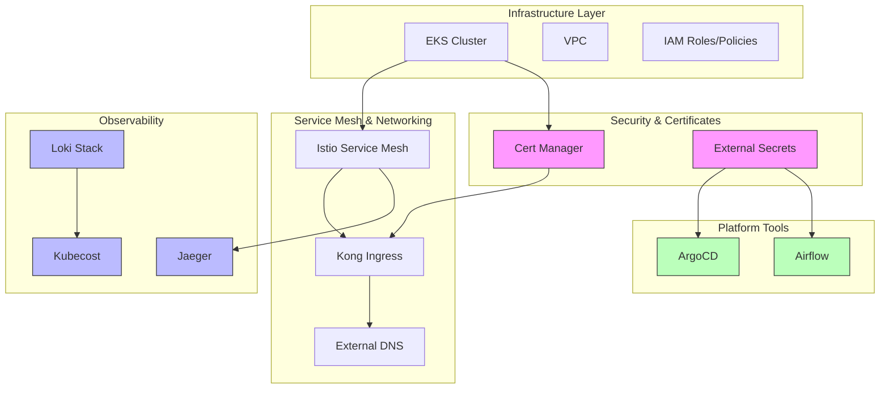
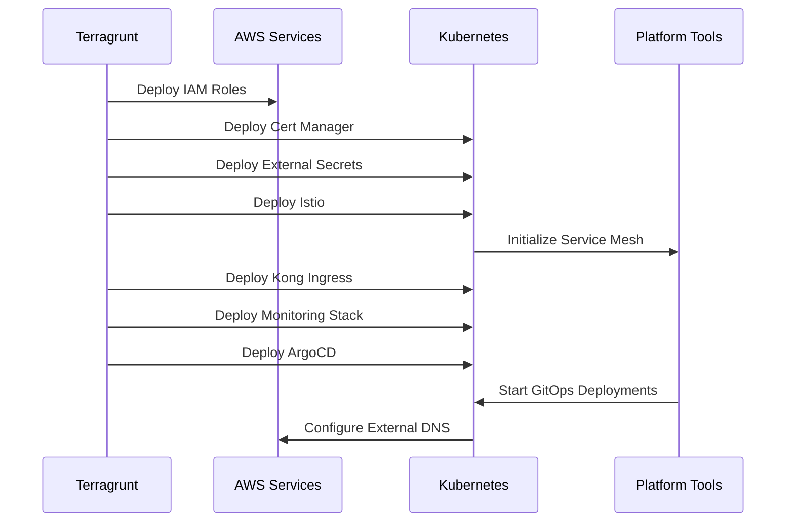
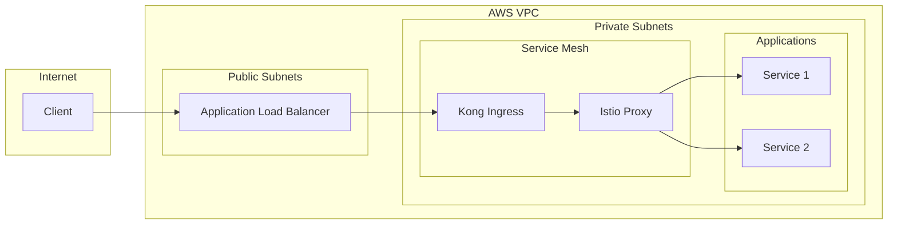
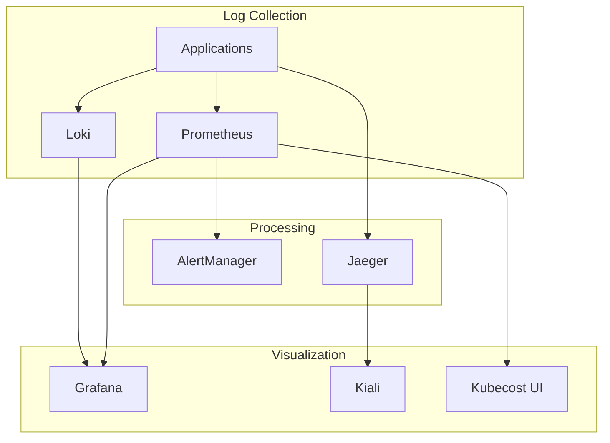
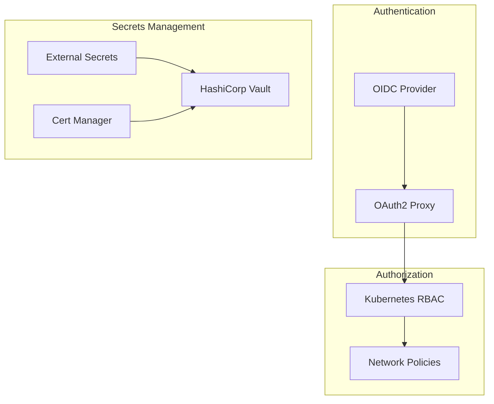

## Architecture

### High-Level Platform Architecture

The platform consists of multiple layers working together to provide a complete Kubernetes infrastructure:



This diagram shows:
- Infrastructure foundation (EKS, VPC, IAM)
- Service mesh and networking components
- Security and certificate management
- Observability stack
- Platform tools integration

### Deployment Flow

The following sequence diagram shows the deployment order and dependencies:



Key deployment stages:
1. Infrastructure prerequisites
2. Security components
3. Networking layer
4. Observability tools
5. Platform services

### Network Architecture

The network architecture shows how traffic flows through the platform:



Features:
- Load balancer in public subnet
- Service mesh in private subnet
- Ingress controller integration
- Secure application access

### Observability Architecture

The observability stack provides comprehensive monitoring and logging:



Components:
- Metrics collection (Prometheus)
- Log aggregation (Loki)
- Tracing (Jaeger)
- Visualization (Grafana, Kiali)
- Cost monitoring (Kubecost)

### Security Architecture

The security architecture ensures comprehensive protection:



Security layers:
- Authentication with OIDC
- Kubernetes RBAC
- Network policies
- Secrets management
- Certificate automation

## Component Relationships

The platform components are designed to work together:

1. **Service Mesh Integration**
   - Istio provides the service mesh foundation
   - Kong Ingress handles external traffic
   - External DNS manages DNS records

2. **Security Integration**
   - Cert Manager works with Let's Encrypt
   - External Secrets integrates with AWS Secrets Manager
   - OIDC provides authentication

3. **Observability Integration**
   - Prometheus collects metrics
   - Loki aggregates logs
   - Jaeger traces requests
   - Grafana visualizes everything

4. **Platform Tools Integration**
   - ArgoCD manages deployments
   - Airflow orchestrates workflows
   - Karpenter handles scaling

# Kubernetes Platform Infrastructure

This repository contains the Terragrunt configurations for deploying and managing a complete Kubernetes platform infrastructure. It includes essential components for running a production-grade Kubernetes cluster with observability, security, and operational tools.

## Repository Structure

```plaintext
.
├── LICENSE
├── common.hcl                 # Common Terragrunt configuration
├── platform_vars.yaml         # Platform-wide variables
├── terragrunt.hcl            # Root Terragrunt configuration
│
├── Service Mesh & Ingress
│   ├── istio/                # Service mesh
│   ├── kong-ingress/         # API Gateway & Ingress controller
│   └── jeager/               # Distributed tracing
│
├── Security & Certificates
│   ├── cert-manager/         # Certificate management
│   └── external-secrets/     # Secrets management
│
├── Observability Stack
│   ├── loki-stack/          # Log aggregation
│   └── kubecost/            # Cost monitoring
│
├── Platform Tools
│   ├── airflow/             # Workflow orchestration
│   ├── argocd/              # GitOps deployment
│   └── external-dns/        # DNS management
│
└── Cluster Management
    └── karpenter/           # Autoscaling
```

## Prerequisites

- Terraform >= 1.5+
- Terragrunt >= 0.60+
- AWS CLI configured with appropriate credentials
- kubectl configured to access your cluster
- Existing EKS cluster

## Component Dependencies

The components should be deployed in the following order:

1. **Core Infrastructure**
   - cert-manager
   - external-secrets
   - karpenter

2. **Service Mesh & Networking**
   - istio
   - kong-ingress
   - external-dns

3. **Observability**
   - loki-stack
   - jaeger
   - kubecost

4. **Platform Tools**
   - argocd
   - airflow

## Configuration

### Common Variables

Common variables are defined in `common.hcl`:
```hcl
locals {
  aws_region = "us-west-2"
  environment = "dev"
  # ... other common variables
}
```

### Platform Variables

Platform-specific configurations are in `platform_vars.yaml`:
```yaml
common:
  environment: "dev"
  vpc_id: "vpc-xxxxx"
  private_subnet_ids:
    - "subnet-xxxxx"
    - "subnet-yyyyy"
  eks_cluster_name: "cluster-name"

Platform:
  Tools:
    # Tool-specific configurations
    argocd:
      inputs:
        # ArgoCD configuration
    airflow:
      inputs:
        # Airflow configuration
    # ... other tool configurations
```

## Usage

### Initialize All Components
```bash
terragrunt run-all init
```

### Plan Changes
```bash
terragrunt run-all plan
```

### Apply Changes
```bash
# Deploy all components
terragrunt run-all apply

# Deploy specific component
cd argocd
terragrunt apply
```

### Destroy Infrastructure
```bash
terragrunt run-all destroy
```

## Component Details

### Service Mesh & Ingress
- **Istio**: Service mesh for traffic management, security, and observability
- **Kong Ingress**: API Gateway and Ingress controller
- **Jaeger**: Distributed tracing for microservices

### Security & Certificates
- **Cert Manager**: Automatic TLS certificate management
- **External Secrets**: Secure external secrets management

### Observability Stack
- **Loki Stack**: Log aggregation and monitoring
- **Kubecost**: Kubernetes cost monitoring and optimization

### Platform Tools
- **ArgoCD**: GitOps continuous delivery
- **Airflow**: Workflow orchestration
- **External DNS**: Automatic DNS management

### Cluster Management
- **Karpenter**: Kubernetes cluster autoscaling

## Contributing

1. Fork the repository
2. Create a feature branch
3. Commit your changes
4. Create a Pull Request

### Development Guidelines

- Follow Terraform best practices
- Update documentation for any changes
- Add appropriate variable descriptions
- Test changes in a non-production environment

## Troubleshooting

### Common Issues

1. **Certificate Issues**
   ```bash
   # Check cert-manager status
   kubectl get certificates -A
   kubectl get certificaterequests -A
   ```

2. **DNS Problems**
   ```bash
   # Verify external-dns logs
   kubectl logs -n external-dns -l app=external-dns
   ```

3. **ArgoCD Sync Issues**
   ```bash
   # Check application status
   kubectl get applications -n argocd
   argocd app get <app-name>
   ```

## Security

- All secrets are managed through external-secrets
- TLS certificates are automated via cert-manager
- Network policies are enforced through istio
- RBAC is configured for each component

## Monitoring

Access the monitoring stack:

- Grafana: `https://grafana.<your-domain>`
- Prometheus: `https://prometheus.<your-domain>`
- Jaeger: `https://jaeger.<your-domain>`
- ArgoCD: `https://argocd.<your-domain>`

## License

See [LICENSE](LICENSE) file.   