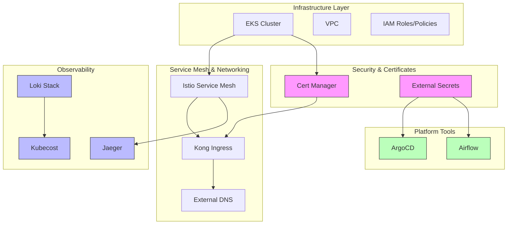
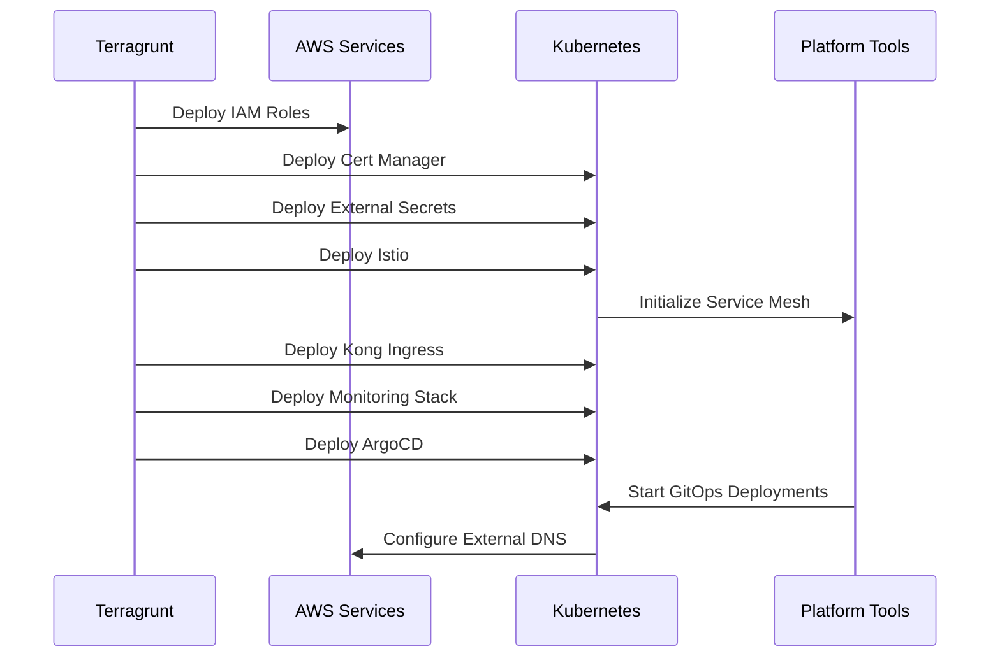
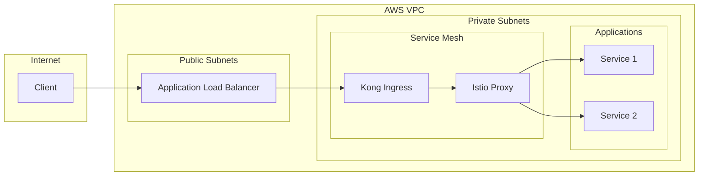
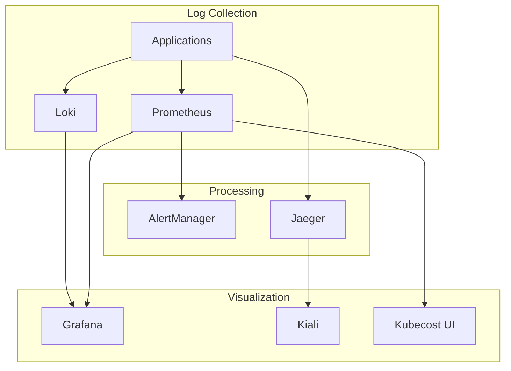
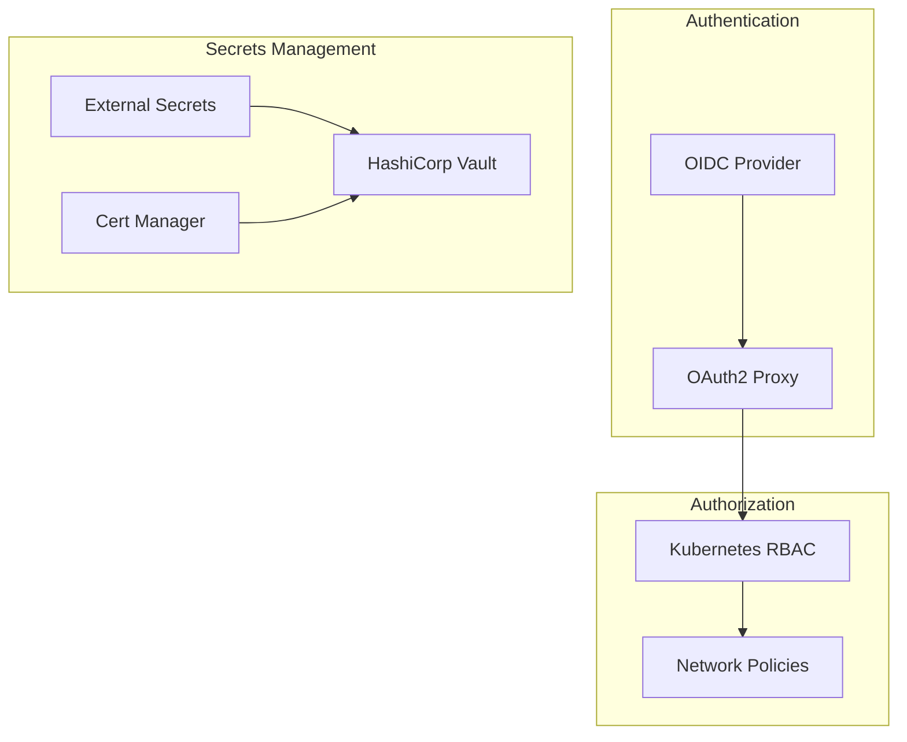

## Architecture

### High-Level Platform Architecture

The platform consists of multiple layers working together to provide a complete Kubernetes infrastructure:

This diagram shows:
- Infrastructure foundation (EKS, VPC, IAM)
- Service mesh and networking components
- Security and certificate management
- Observability stack
- Platform tools integration

### Deployment Flow

The following sequence diagram shows the deployment order and dependencies:

Key deployment stages:
1. Infrastructure prerequisites
2. Security components
3. Networking layer
4. Observability tools
5. Platform services

### Network Architecture

The network architecture shows how traffic flows through the platform:

Features:
- Load balancer in public subnet
- Service mesh in private subnet
- Ingress controller integration
- Secure application access

### Observability Architecture

The observability stack provides comprehensive monitoring and logging:

Components:
- Metrics collection (Prometheus)
- Log aggregation (Loki)
- Tracing (Jaeger)
- Visualization (Grafana, Kiali)
- Cost monitoring (Kubecost)

### Security Architecture

The security architecture ensures comprehensive protection:

Security layers:
- Authentication with OIDC
- Kubernetes RBAC
- Network policies
- Secrets management
- Certificate automation

## Component Relationships

The platform components are designed to work together:

1. **Service Mesh Integration**
   - Istio provides the service mesh foundation
   - Kong Ingress handles external traffic
   - External DNS manages DNS records

2. **Security Integration**
   - Cert Manager works with Let's Encrypt
   - External Secrets integrates with AWS Secrets Manager
   - OIDC provides authentication

3. **Observability Integration**
   - Prometheus collects metrics
   - Loki aggregates logs
   - Jaeger traces requests
   - Grafana visualizes everything

4. **Platform Tools Integration**
   - ArgoCD manages deployments
   - Airflow orchestrates workflows
   - Karpenter handles scaling